# Design Patterns for OOP and LLD Placements

This note is a placement-focused reference for commonly asked design patterns in object-oriented programming and low-level design interviews.

The goal is not to memorize code. The goal is to recognize design pressure:

- Too many `if-else` statements?
- Object creation is messy?
- Many classes need updates when one thing changes?
- You need to wrap behavior without changing existing code?
- You need to expose a simpler interface over a complex system?

Design patterns are named, reusable solutions to recurring design problems.

## Table of Contents

1. [How to Think About Design Patterns](#how-to-think-about-design-patterns)
2. [Creational Patterns](#creational-patterns)
   - [Singleton](#singleton)
   - [Factory](#factory)
   - [Abstract Factory](#abstract-factory)
   - [Builder](#builder)
3. [Behavioral Patterns](#behavioral-patterns)
   - [Strategy](#strategy)
   - [Observer](#observer)
   - [Command](#command)
4. [Structural Patterns](#structural-patterns)
   - [Decorator](#decorator)
   - [Adapter](#adapter)
   - [Proxy](#proxy)
5. [Architectural Pattern](#architectural-pattern)
   - [MVC](#mvc)
6. [Pattern Comparison Cheat Sheet](#pattern-comparison-cheat-sheet)
7. [How to Use Patterns in LLD Interviews](#how-to-use-patterns-in-lld-interviews)

---

# How to Think About Design Patterns

## What is a design pattern?

A design pattern is a standard solution to a common software design problem.

It usually describes:

- The problem
- The forces or constraints
- The participating classes or interfaces
- The collaboration between objects
- Trade-offs

## Why interviewers ask design patterns

Interviewers usually do not care if you can recite definitions. They care whether you can:

- Design extensible systems
- Avoid tight coupling
- Apply SOLID principles
- Choose the right abstraction
- Explain trade-offs
- Keep the design simple

## Pattern categories

### Creational patterns

Handle object creation.

Examples:

- Singleton
- Factory
- Abstract Factory
- Builder

Useful when construction logic is complex, repeated, or should be hidden.

### Structural patterns

Handle object composition.

Examples:

- Decorator
- Adapter
- Proxy

Useful when you need to combine objects, wrap objects, or make incompatible interfaces work together.

### Behavioral patterns

Handle communication and responsibility between objects.

Examples:

- Strategy
- Observer
- Command

Useful when behavior varies, events happen, or actions need to be represented as objects.

### Architectural patterns

Organize the whole application.

Example:

- MVC

Useful when separating UI, business logic, and data flow.

## SOLID principles behind patterns

Most design patterns are practical applications of SOLID.

### Single Responsibility Principle

A class should have one reason to change.

Example:

- In MVC, Model, View, and Controller have separate responsibilities.

### Open/Closed Principle

Code should be open for extension but closed for modification.

Example:

- Strategy lets you add a new payment method without modifying existing payment logic.

### Liskov Substitution Principle

Subtypes should be replaceable wherever the parent type is expected.

Example:

- Any `PaymentStrategy` should work wherever a payment strategy is needed.

### Interface Segregation Principle

Clients should not depend on methods they do not use.

Example:

- Smaller strategy interfaces are better than one huge interface.

### Dependency Inversion Principle

High-level modules should depend on abstractions, not concrete classes.

Example:

- A service depends on `NotificationSender`, not `EmailNotificationSender`.

---

# Singleton

## Intent

Ensure a class has only one instance and provide a global access point to it.

## Problem

Some objects represent a single shared resource or configuration:

- Application configuration
- Logger
- Thread pool
- Database connection manager
- Cache manager

Creating many instances may be wasteful, inconsistent, or incorrect.

## Basic idea

The class:

- Hides its constructor
- Stores one static instance
- Exposes a static method to access that instance

## Java example: eager initialization

```java
public class AppConfig {
    private static final AppConfig INSTANCE = new AppConfig();

    private AppConfig() {
    }

    public static AppConfig getInstance() {
        return INSTANCE;
    }

    public String getValue(String key) {
        return "some-value";
    }
}
```

Usage:

```java
AppConfig config = AppConfig.getInstance();
```

## Java example: lazy initialization with double-checked locking

```java
public class Logger {
    private static volatile Logger instance;

    private Logger() {
    }

    public static Logger getInstance() {
        if (instance == null) {
            synchronized (Logger.class) {
                if (instance == null) {
                    instance = new Logger();
                }
            }
        }
        return instance;
    }

    public void log(String message) {
        System.out.println(message);
    }
}
```

## Java example: enum singleton

```java
public enum AppLogger {
    INSTANCE;

    public void log(String message) {
        System.out.println(message);
    }
}
```

Usage:

```java
AppLogger.INSTANCE.log("Application started");
```

## Why enum singleton is strong in Java

Enum singleton handles:

- Serialization issues
- Reflection attacks better than normal constructors
- Thread safety

## UML-style structure

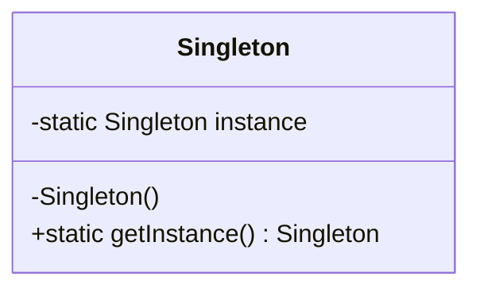

## Real-world LLD examples

### Logging system

One logger instance is shared across services.

### Configuration manager

One loaded config object is shared across the application.

### Cache manager

One shared cache manager coordinates cached data.

## Advantages

- Controlled access to a single instance
- Avoids repeated expensive creation
- Useful for shared resources
- Easy to access

## Disadvantages

- Can become hidden global state
- Makes unit testing harder
- Can hide dependencies
- Can violate Single Responsibility if overused
- Thread safety needs care

## Common interview traps

### Trap 1: Singleton is always good for database connections

Usually, a database connection itself should not be a singleton. A connection pool or data source manager may be singleton-like.

### Trap 2: Singleton is dependency injection

Singleton gives global access. Dependency injection passes dependencies explicitly. DI is usually better for testability.

### Trap 3: Lazy singleton without synchronization

This is unsafe in multithreaded code:

```java
if (instance == null) {
    instance = new Singleton();
}
```

Multiple threads may create multiple instances.

## Placement-ready answer

Singleton ensures only one instance of a class exists and provides a global access point. I would use it for shared infrastructure-like objects such as config managers or loggers, but carefully because it introduces global state and can make testing harder. In Java, enum singleton is often the safest implementation.

---

# Factory

## Intent

Create objects without exposing the object creation logic to the client.

## Problem

Client code should not know which concrete class to instantiate.

Bad code:

```java
if (type.equals("CAR")) {
    vehicle = new Car();
} else if (type.equals("BIKE")) {
    vehicle = new Bike();
}
```

This spreads creation logic everywhere.

## Basic idea

Move object creation into a factory.

Client asks the factory for an object.

## Java example

```java
interface Vehicle {
    void drive();
}

class Car implements Vehicle {
    public void drive() {
        System.out.println("Driving car");
    }
}

class Bike implements Vehicle {
    public void drive() {
        System.out.println("Riding bike");
    }
}

class VehicleFactory {
    public static Vehicle createVehicle(String type) {
        if ("CAR".equalsIgnoreCase(type)) {
            return new Car();
        }
        if ("BIKE".equalsIgnoreCase(type)) {
            return new Bike();
        }
        throw new IllegalArgumentException("Unknown vehicle type: " + type);
    }
}
```

Usage:

```java
Vehicle vehicle = VehicleFactory.createVehicle("CAR");
vehicle.drive();
```

## Better Java example using enum

```java
enum VehicleType {
    CAR,
    BIKE
}

class VehicleFactory {
    public static Vehicle createVehicle(VehicleType type) {
        return switch (type) {
            case CAR -> new Car();
            case BIKE -> new Bike();
        };
    }
}
```

## UML-style structure

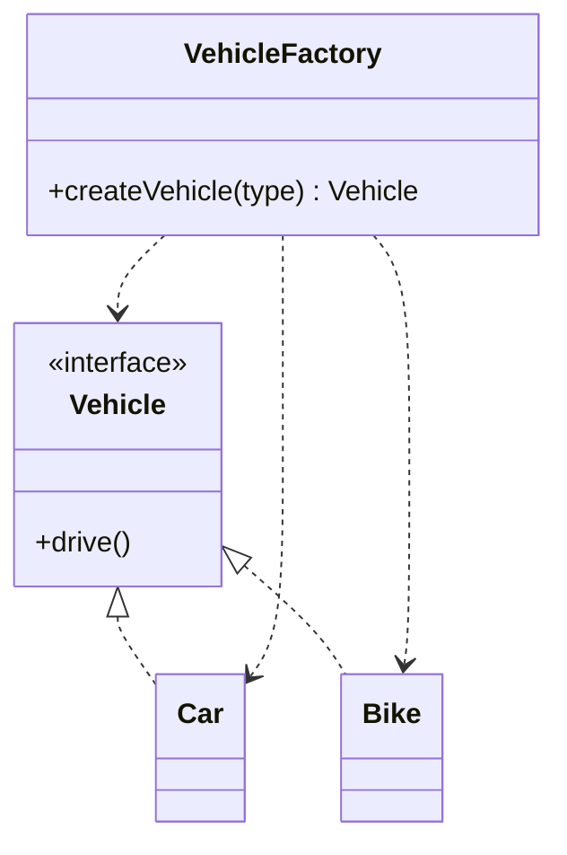

## Real-world LLD examples

### Notification system

Create email, SMS, or push notification senders.

```java
NotificationSender sender = NotificationFactory.create(Channel.EMAIL);
```

### Payment system

Create payment processors for UPI, card, wallet, or net banking.

### Shape drawing app

Create circle, rectangle, or triangle based on user input.

### Vehicle rental system

Create car, bike, or truck objects depending on rental type.

## Advantages

- Centralizes object creation
- Reduces duplicate `new` logic
- Decouples client from concrete classes
- Makes creation rules easier to change

## Disadvantages

- Factory can grow large
- Adding a new type may require changing the factory
- Too many factories can overcomplicate small systems

## Factory and Open/Closed Principle

A simple factory often still requires modification when adding a new type.

For example, adding `Truck` requires changing `VehicleFactory`.

To improve this, you can use registration:

```java
class VehicleFactory {
    private final Map<VehicleType, Supplier<Vehicle>> creators = new HashMap<>();

    public void register(VehicleType type, Supplier<Vehicle> creator) {
        creators.put(type, creator);
    }

    public Vehicle create(VehicleType type) {
        Supplier<Vehicle> creator = creators.get(type);
        if (creator == null) {
            throw new IllegalArgumentException("Unknown vehicle type");
        }
        return creator.get();
    }
}
```

## Placement-ready answer

Factory pattern hides object creation logic from the client. Instead of directly instantiating concrete classes, the client asks a factory for an object through a common interface. It is useful when creation depends on input, configuration, or type.

---

# Abstract Factory

## Intent

Create families of related objects without specifying their concrete classes.

## Problem

Sometimes objects must be created together because they belong to the same family.

Example: UI components for different operating systems.

- Windows button should go with Windows checkbox
- Mac button should go with Mac checkbox

Bad design can accidentally mix incompatible products:

```java
Button button = new WindowsButton();
Checkbox checkbox = new MacCheckbox();
```

## Basic idea

Use a factory interface that creates multiple related products.

## Java example: UI theme factory

```java
interface Button {
    void render();
}

interface Checkbox {
    void render();
}

class WindowsButton implements Button {
    public void render() {
        System.out.println("Rendering Windows button");
    }
}

class WindowsCheckbox implements Checkbox {
    public void render() {
        System.out.println("Rendering Windows checkbox");
    }
}

class MacButton implements Button {
    public void render() {
        System.out.println("Rendering Mac button");
    }
}

class MacCheckbox implements Checkbox {
    public void render() {
        System.out.println("Rendering Mac checkbox");
    }
}

interface UIFactory {
    Button createButton();
    Checkbox createCheckbox();
}

class WindowsUIFactory implements UIFactory {
    public Button createButton() {
        return new WindowsButton();
    }

    public Checkbox createCheckbox() {
        return new WindowsCheckbox();
    }
}

class MacUIFactory implements UIFactory {
    public Button createButton() {
        return new MacButton();
    }

    public Checkbox createCheckbox() {
        return new MacCheckbox();
    }
}
```

Usage:

```java
class Application {
    private final Button button;
    private final Checkbox checkbox;

    public Application(UIFactory factory) {
        this.button = factory.createButton();
        this.checkbox = factory.createCheckbox();
    }

    public void render() {
        button.render();
        checkbox.render();
    }
}
```

## UML-style structure

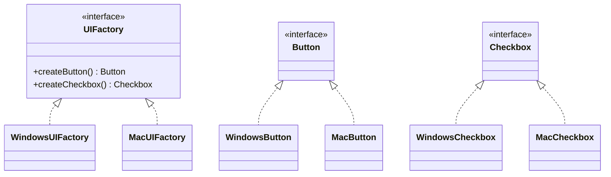

## Real-world LLD examples

### Cross-platform UI toolkit

Create related UI widgets for Windows, Mac, or Linux.

### Cloud provider abstraction

Create related services for AWS, Azure, or GCP:

- Storage client
- Compute client
- Queue client

### Database family

Create related database components:

- Connection
- Command
- Transaction

### Vehicle manufacturing

Create related parts for a vehicle family:

- Engine
- Tyre
- Brake

## Factory vs Abstract Factory

Factory creates one product.

Abstract Factory creates a family of related products.

Example:

- Factory: create a `Vehicle`
- Abstract Factory: create `Engine`, `Tyre`, and `Brake` for a vehicle family

## Advantages

- Ensures compatible objects are used together
- Hides concrete classes
- Makes switching product families easy
- Supports Dependency Inversion

## Disadvantages

- More interfaces and classes
- Adding a new product type is hard
- Can be overkill for simple creation logic

## Common interview trap

If there is only one object type to create, Abstract Factory is probably unnecessary. Use Factory.

## Placement-ready answer

Abstract Factory provides an interface to create families of related objects. It is useful when the system should be independent of concrete classes and when created objects must be compatible with each other, such as UI components for a specific platform.

---

# Builder

## Intent

Construct complex objects step by step.

## Problem

A class may have many optional fields.

Constructor becomes unreadable:

```java
User user = new User("Amit", "amit@mail.com", 22, "Delhi", true, false);
```

This is hard to read and error-prone.

## Basic idea

Use a builder object to set fields clearly and then build the final object.

## Java example

```java
public class User {
    private final String name;
    private final String email;
    private final int age;
    private final String city;
    private final boolean verified;

    private User(Builder builder) {
        this.name = builder.name;
        this.email = builder.email;
        this.age = builder.age;
        this.city = builder.city;
        this.verified = builder.verified;
    }

    public static class Builder {
        private final String name;
        private final String email;
        private int age;
        private String city;
        private boolean verified;

        public Builder(String name, String email) {
            this.name = name;
            this.email = email;
        }

        public Builder age(int age) {
            this.age = age;
            return this;
        }

        public Builder city(String city) {
            this.city = city;
            return this;
        }

        public Builder verified(boolean verified) {
            this.verified = verified;
            return this;
        }

        public User build() {
            return new User(this);
        }
    }
}
```

Usage:

```java
User user = new User.Builder("Amit", "amit@mail.com")
        .age(22)
        .city("Delhi")
        .verified(true)
        .build();
```

## Builder with validation

```java
public User build() {
    if (age < 0) {
        throw new IllegalArgumentException("Age cannot be negative");
    }
    return new User(this);
}
```

## UML-style structure

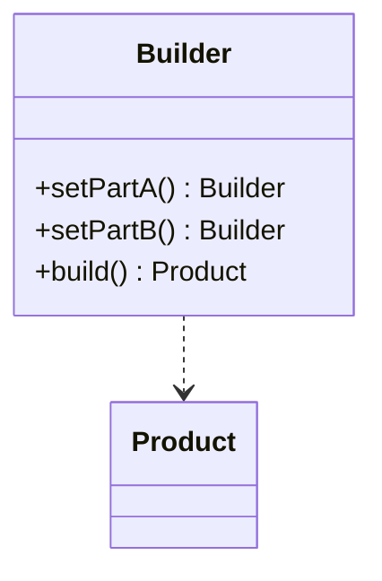

## Real-world LLD examples

### Food ordering system

Build a meal with optional items:

- Base item
- Toppings
- Drink
- Dessert
- Packaging preference

### HTTP request builder

Build a request with:

- URL
- Method
- Headers
- Query params
- Body
- Timeout

### Resume builder

Build a resume object from sections:

- Personal info
- Education
- Experience
- Projects
- Skills

### SQL query builder

Build a query step by step:

```java
Query query = Query.builder()
        .select("name", "email")
        .from("users")
        .where("age > 18")
        .orderBy("name")
        .build();
```

## Advantages

- Improves readability
- Handles many optional fields cleanly
- Helps create immutable objects
- Can centralize validation
- Avoids telescoping constructors

## Disadvantages

- More code
- Overkill for simple objects
- Builder may duplicate fields from the product

## Builder vs Factory

Factory chooses which class to create.

Builder controls how a complex object is assembled.

Use Factory when:

- There are multiple possible concrete classes.

Use Builder when:

- One object has many fields or construction steps.

## Placement-ready answer

Builder is used to construct complex objects step by step, especially when there are many optional parameters. It improves readability, avoids telescoping constructors, and is commonly used for immutable objects.

---

# Strategy

## Intent

Define a family of algorithms, put each algorithm in a separate class, and make them interchangeable.

## Problem

Suppose payment behavior varies:

```java
if (paymentType.equals("CARD")) {
    payByCard();
} else if (paymentType.equals("UPI")) {
    payByUpi();
} else if (paymentType.equals("WALLET")) {
    payByWallet();
}
```

This violates Open/Closed Principle. Adding a new payment type modifies existing code.

## Basic idea

Create a common interface for behavior. Each algorithm implements that interface.

## Java example: payment strategy

```java
interface PaymentStrategy {
    void pay(double amount);
}

class CardPayment implements PaymentStrategy {
    public void pay(double amount) {
        System.out.println("Paid " + amount + " using card");
    }
}

class UpiPayment implements PaymentStrategy {
    public void pay(double amount) {
        System.out.println("Paid " + amount + " using UPI");
    }
}

class WalletPayment implements PaymentStrategy {
    public void pay(double amount) {
        System.out.println("Paid " + amount + " using wallet");
    }
}

class PaymentService {
    private PaymentStrategy paymentStrategy;

    public PaymentService(PaymentStrategy paymentStrategy) {
        this.paymentStrategy = paymentStrategy;
    }

    public void setPaymentStrategy(PaymentStrategy paymentStrategy) {
        this.paymentStrategy = paymentStrategy;
    }

    public void checkout(double amount) {
        paymentStrategy.pay(amount);
    }
}
```

Usage:

```java
PaymentService service = new PaymentService(new UpiPayment());
service.checkout(500);

service.setPaymentStrategy(new CardPayment());
service.checkout(1000);
```

## UML-style structure

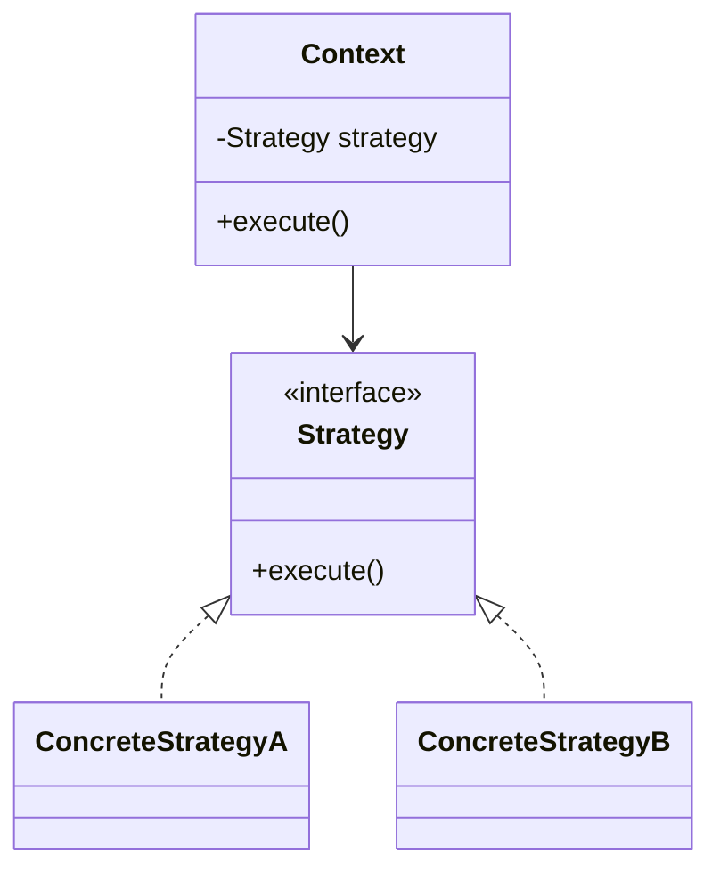

## Real-world LLD examples

### Payment system

Strategies:

- Card payment
- UPI payment
- Wallet payment
- Net banking

### Maps/navigation app

Route strategies:

- Fastest route
- Shortest route
- Cheapest route
- Avoid tolls

### Sorting system

Sorting strategies:

- Quick sort
- Merge sort
- Heap sort

### Parking lot pricing

Pricing strategies:

- Hourly pricing
- Daily pricing
- Weekend pricing
- Event pricing

### Discount engine

Discount strategies:

- Percentage discount
- Flat discount
- Buy one get one
- Coupon discount

## Advantages

- Removes large conditional blocks
- Makes algorithms interchangeable
- Supports Open/Closed Principle
- Improves testability
- Keeps each algorithm isolated

## Disadvantages

- More classes
- Client must choose the correct strategy
- Can be unnecessary if behavior rarely changes

## Strategy vs Factory

Factory creates objects.

Strategy selects behavior.

They are often used together:

```java
PaymentStrategy strategy = PaymentStrategyFactory.create(paymentType);
paymentService.setPaymentStrategy(strategy);
```

## Strategy vs State

Strategy changes behavior based on external choice.

State changes behavior based on internal object state.

Example:

- Strategy: user chooses payment method
- State: order behaves differently when pending, shipped, or delivered

## Placement-ready answer

Strategy pattern is used when we have multiple algorithms or behaviors that should be interchangeable. Instead of writing conditionals, we define a common interface and implement each behavior separately. It helps satisfy Open/Closed Principle and is common in payment, pricing, sorting, and routing systems.

---

# Observer

## Intent

Define a one-to-many dependency so that when one object changes state, all dependent objects are notified automatically.

## Problem

Many objects may need to react when something changes.

Example:

- Stock price changes
- Subscribers should receive updates
- UI should refresh
- Alerts should be sent

Hard-coding all dependents creates tight coupling.

## Basic idea

Subject keeps a list of observers.

When subject changes, it notifies all observers.

## Java example: stock price notification

```java
interface Observer {
    void update(String symbol, double price);
}

class EmailAlert implements Observer {
    public void update(String symbol, double price) {
        System.out.println("Email alert: " + symbol + " is now " + price);
    }
}

class MobileAlert implements Observer {
    public void update(String symbol, double price) {
        System.out.println("Mobile alert: " + symbol + " is now " + price);
    }
}

class Stock {
    private final String symbol;
    private double price;
    private final List<Observer> observers = new ArrayList<>();

    public Stock(String symbol) {
        this.symbol = symbol;
    }

    public void addObserver(Observer observer) {
        observers.add(observer);
    }

    public void removeObserver(Observer observer) {
        observers.remove(observer);
    }

    public void setPrice(double price) {
        this.price = price;
        notifyObservers();
    }

    private void notifyObservers() {
        for (Observer observer : observers) {
            observer.update(symbol, price);
        }
    }
}
```

Usage:

```java
Stock stock = new Stock("TCS");
stock.addObserver(new EmailAlert());
stock.addObserver(new MobileAlert());

stock.setPrice(3900);
```

## UML-style structure

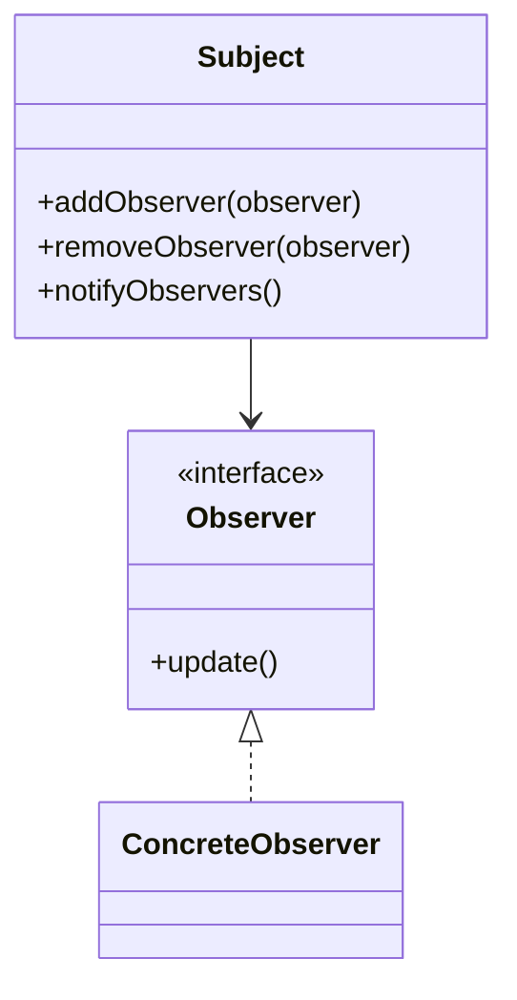

## Push vs pull model

### Push model

Subject sends data directly.

```java
observer.update(symbol, price);
```

Pros:

- Simple
- Observer gets data immediately

Cons:

- Observer receives whatever subject decides to send

### Pull model

Subject tells observer something changed. Observer queries subject.

```java
observer.update(this);
```

Pros:

- Observer can pull only what it needs

Cons:

- Observer now knows more about subject

## Real-world LLD examples

### Notification system

Notify users when order status changes.

### YouTube subscription

Subscribers are notified when a channel uploads a video.

### Stock market alerts

Observers react when price crosses a threshold.

### GUI event listeners

Buttons notify listeners when clicked.

### Chat application

Users in a group are notified when a message is posted.

## Advantages

- Loose coupling between subject and observers
- Dynamic subscription and unsubscription
- Supports event-driven design
- Easy to add new observers

## Disadvantages

- Notification order may be unpredictable
- Memory leaks if observers are not removed
- Can be hard to debug in large systems
- One slow observer can delay others in synchronous design

## Observer in distributed systems

In real distributed systems, Observer often becomes pub-sub.

Examples:

- Kafka
- RabbitMQ
- Redis Pub/Sub

Subject publishes events. Subscribers consume events asynchronously.

## Placement-ready answer

Observer pattern is used when multiple objects need to be notified when another object changes. The subject maintains observers and notifies them on state changes. It is useful for event-driven systems like notification services, stock alerts, subscriptions, and UI listeners.

---

# Decorator

## Intent

Add new behavior to an object dynamically without changing its class.

## Problem

Suppose a coffee shop has:

- Simple coffee
- Coffee with milk
- Coffee with sugar
- Coffee with milk and sugar
- Coffee with caramel

Subclassing every combination explodes:

```text
MilkCoffee
SugarCoffee
MilkSugarCoffee
CaramelMilkSugarCoffee
```

## Basic idea

Wrap the original object inside decorator objects.

Each decorator adds behavior and delegates to the wrapped object.

## Java example: coffee

```java
interface Coffee {
    double cost();
    String description();
}

class SimpleCoffee implements Coffee {
    public double cost() {
        return 50;
    }

    public String description() {
        return "Simple coffee";
    }
}

abstract class CoffeeDecorator implements Coffee {
    protected final Coffee coffee;

    protected CoffeeDecorator(Coffee coffee) {
        this.coffee = coffee;
    }
}

class MilkDecorator extends CoffeeDecorator {
    public MilkDecorator(Coffee coffee) {
        super(coffee);
    }

    public double cost() {
        return coffee.cost() + 10;
    }

    public String description() {
        return coffee.description() + ", milk";
    }
}

class SugarDecorator extends CoffeeDecorator {
    public SugarDecorator(Coffee coffee) {
        super(coffee);
    }

    public double cost() {
        return coffee.cost() + 5;
    }

    public String description() {
        return coffee.description() + ", sugar";
    }
}
```

Usage:

```java
Coffee coffee = new SimpleCoffee();
coffee = new MilkDecorator(coffee);
coffee = new SugarDecorator(coffee);

System.out.println(coffee.description());
System.out.println(coffee.cost());
```

## UML-style structure

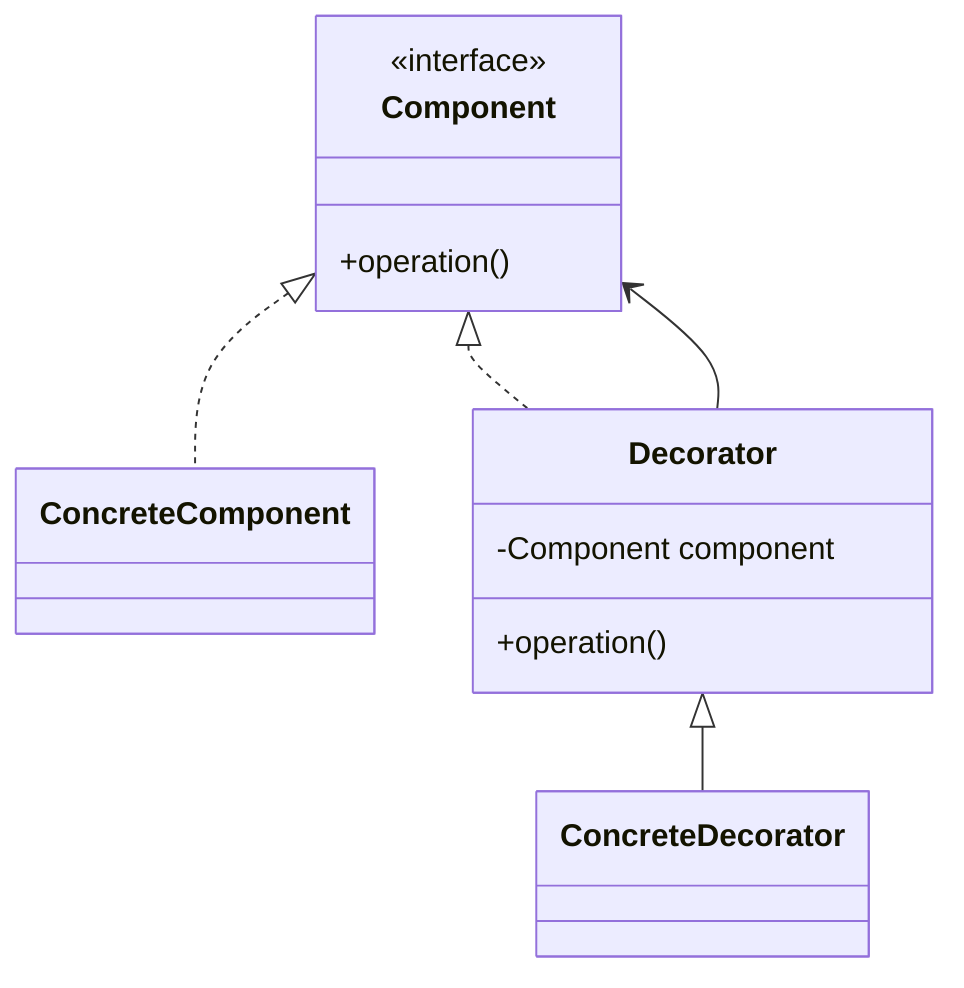

## Real-world LLD examples

### Coffee ordering system

Add toppings dynamically.

### Notification system

Base notification plus:

- Email
- SMS
- Slack
- Push notification

### Text editor

Text component plus:

- Bold
- Italic
- Underline
- Border

### Java IO

Classic example:

```java
BufferedInputStream bis = new BufferedInputStream(
        new FileInputStream("file.txt")
);
```

Each stream wrapper adds behavior.

## Advantages

- Adds behavior without modifying existing class
- Avoids subclass explosion
- Supports composition over inheritance
- Decorators can be combined flexibly

## Disadvantages

- Many small classes
- Debugging wrapped objects can be harder
- Order of decorators may matter

## Decorator vs Inheritance

Inheritance adds behavior statically at compile time.

Decorator adds behavior dynamically at runtime.

## Decorator vs Proxy

Decorator adds responsibilities.

Proxy controls access.

Example:

- Decorator: add compression to a data stream
- Proxy: check authorization before accessing data

## Placement-ready answer

Decorator pattern adds behavior to an object dynamically by wrapping it with decorator objects that implement the same interface. It is useful when we want flexible combinations of behavior without creating many subclasses.

---

# Adapter

## Intent

Allow incompatible interfaces to work together.

## Problem

Your code expects one interface, but an existing class or third-party library exposes another interface.

Example:

Application expects:

```java
interface PaymentProcessor {
    void pay(double amount);
}
```

Third-party gateway provides:

```java
class RazorpayGateway {
    void makePayment(int amountInPaise) {
        System.out.println("Paid using Razorpay");
    }
}
```

The interfaces do not match.

## Basic idea

Create an adapter that implements the expected interface and internally calls the incompatible object.

## Java example

```java
interface PaymentProcessor {
    void pay(double amount);
}

class RazorpayGateway {
    public void makePayment(int amountInPaise) {
        System.out.println("Paid " + amountInPaise + " paise using Razorpay");
    }
}

class RazorpayAdapter implements PaymentProcessor {
    private final RazorpayGateway gateway;

    public RazorpayAdapter(RazorpayGateway gateway) {
        this.gateway = gateway;
    }

    public void pay(double amount) {
        int amountInPaise = (int) (amount * 100);
        gateway.makePayment(amountInPaise);
    }
}
```

Usage:

```java
PaymentProcessor processor = new RazorpayAdapter(new RazorpayGateway());
processor.pay(499.50);
```

## UML-style structure

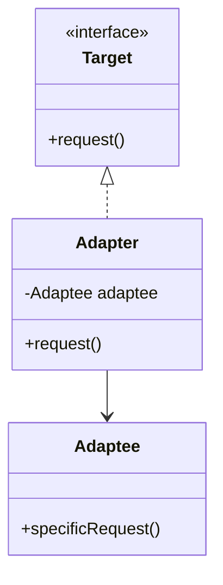

## Object adapter vs class adapter

### Object adapter

Uses composition.

```java
class Adapter implements Target {
    private final Adaptee adaptee;
}
```

This is common in Java.

### Class adapter

Uses inheritance.

Java cannot easily do this if multiple inheritance is needed.

## Real-world LLD examples

### Payment gateway integration

Adapt Razorpay, Stripe, PayPal, or Paytm to one internal interface.

### External API wrapper

Adapt third-party response formats to your domain model.

### Legacy system integration

New code expects modern interface, old class has different methods.

### Media player

Application supports `play(file)`, but different codecs have different APIs.

## Advantages

- Reuses existing incompatible classes
- Keeps client code clean
- Isolates third-party library changes
- Supports Dependency Inversion

## Disadvantages

- Adds extra layer
- Too many adapters can hide complexity
- Poor adapter design can leak third-party concepts

## Adapter vs Facade

Adapter changes an interface to match what client expects.

Facade simplifies a complex subsystem.

Example:

- Adapter: convert Razorpay API to `PaymentProcessor`
- Facade: expose one method `bookMovie()` over seat locking, payment, ticket generation, and notification

## Placement-ready answer

Adapter pattern lets incompatible interfaces work together. It wraps an existing class and exposes the interface expected by the client. It is commonly used while integrating third-party APIs, payment gateways, legacy systems, and external services.

---

# Proxy

## Intent

Provide a substitute object that controls access to another object.

## Problem

Direct access to an object may be expensive, unsafe, or require extra checks.

Examples:

- Load image only when needed
- Check authorization before accessing data
- Cache expensive API calls
- Log method calls
- Access remote service

## Basic idea

Proxy implements the same interface as the real object.

Client talks to proxy. Proxy decides when and how to call real object.

## Java example: protection proxy

```java
interface Document {
    void display();
}

class RealDocument implements Document {
    private final String content;

    public RealDocument(String content) {
        this.content = content;
    }

    public void display() {
        System.out.println(content);
    }
}

class DocumentProxy implements Document {
    private final RealDocument document;
    private final String userRole;

    public DocumentProxy(RealDocument document, String userRole) {
        this.document = document;
        this.userRole = userRole;
    }

    public void display() {
        if (!"ADMIN".equals(userRole)) {
            throw new SecurityException("Access denied");
        }
        document.display();
    }
}
```

Usage:

```java
Document document = new DocumentProxy(new RealDocument("Secret file"), "ADMIN");
document.display();
```

## Java example: virtual proxy for lazy loading

```java
interface Image {
    void display();
}

class RealImage implements Image {
    private final String fileName;

    public RealImage(String fileName) {
        this.fileName = fileName;
        loadFromDisk();
    }

    private void loadFromDisk() {
        System.out.println("Loading " + fileName);
    }

    public void display() {
        System.out.println("Displaying " + fileName);
    }
}

class ImageProxy implements Image {
    private final String fileName;
    private RealImage realImage;

    public ImageProxy(String fileName) {
        this.fileName = fileName;
    }

    public void display() {
        if (realImage == null) {
            realImage = new RealImage(fileName);
        }
        realImage.display();
    }
}
```

## UML-style structure

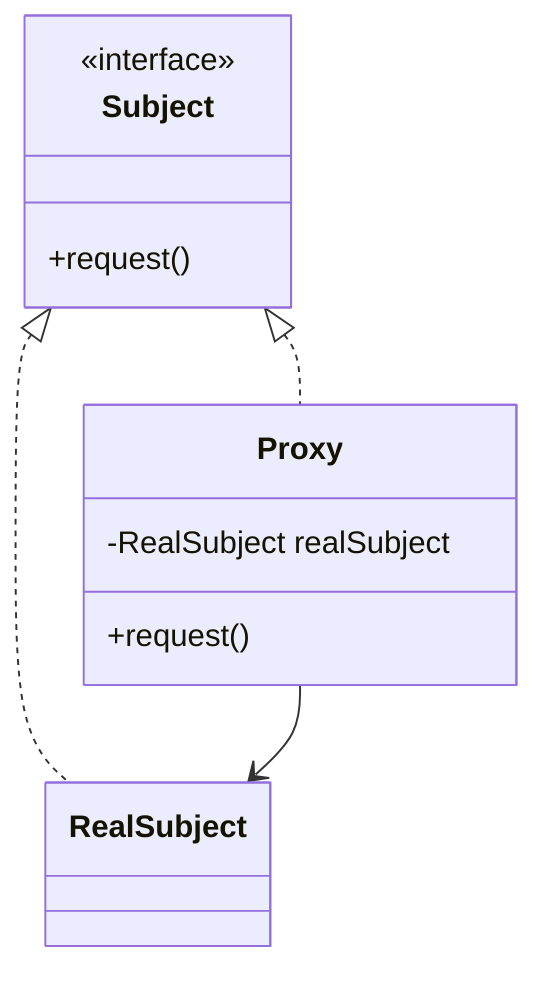

## Types of proxies

### Virtual proxy

Creates expensive objects only when needed.

Example:

- Lazy image loading

### Protection proxy

Controls access based on permissions.

Example:

- Only admin can open confidential document

### Remote proxy

Represents an object in another address space.

Example:

- Client-side object representing remote service

### Caching proxy

Stores results to avoid repeated expensive operations.

Example:

- Cache API responses

### Logging proxy

Logs calls before forwarding.

Example:

- Audit service method calls

## Real-world LLD examples

### File access system

Check permissions before opening files.

### Image gallery

Lazy-load images when user scrolls.

### API client

Cache remote API response.

### Database access

Add transaction, logging, or access control around repository calls.

## Advantages

- Controls access to real object
- Adds lazy loading, caching, logging, or security
- Keeps client unaware of access logic
- Can reduce resource usage

## Disadvantages

- Adds indirection
- May make debugging harder
- Proxy logic can become complex
- Response can be delayed due to lazy initialization

## Proxy vs Decorator

Both wrap an object and implement the same interface.

Main difference:

- Decorator adds new behavior or responsibilities
- Proxy controls access to the object

## Placement-ready answer

Proxy pattern provides a substitute for a real object and controls access to it. The proxy implements the same interface as the real object and can add lazy loading, access control, caching, logging, or remote communication.

---

# Command

## Intent

Encapsulate a request as an object.

## Problem

You may want to:

- Queue operations
- Log operations
- Undo operations
- Retry failed operations
- Decouple sender from receiver

Direct method calls are not flexible enough.

## Basic idea

Create a command interface with an `execute()` method.

Each concrete command knows:

- Receiver object
- Action to perform
- Required parameters

## Java example: remote control

```java
interface Command {
    void execute();
}

class Light {
    public void turnOn() {
        System.out.println("Light on");
    }

    public void turnOff() {
        System.out.println("Light off");
    }
}

class TurnOnLightCommand implements Command {
    private final Light light;

    public TurnOnLightCommand(Light light) {
        this.light = light;
    }

    public void execute() {
        light.turnOn();
    }
}

class TurnOffLightCommand implements Command {
    private final Light light;

    public TurnOffLightCommand(Light light) {
        this.light = light;
    }

    public void execute() {
        light.turnOff();
    }
}

class RemoteControl {
    private Command command;

    public void setCommand(Command command) {
        this.command = command;
    }

    public void pressButton() {
        command.execute();
    }
}
```

Usage:

```java
Light light = new Light();
RemoteControl remote = new RemoteControl();

remote.setCommand(new TurnOnLightCommand(light));
remote.pressButton();

remote.setCommand(new TurnOffLightCommand(light));
remote.pressButton();
```

## Command with undo

```java
interface UndoableCommand {
    void execute();
    void undo();
}

class TextEditor {
    private final StringBuilder text = new StringBuilder();

    public void addText(String value) {
        text.append(value);
    }

    public void removeLast(int length) {
        text.delete(text.length() - length, text.length());
    }

    public String getText() {
        return text.toString();
    }
}

class AddTextCommand implements UndoableCommand {
    private final TextEditor editor;
    private final String value;

    public AddTextCommand(TextEditor editor, String value) {
        this.editor = editor;
        this.value = value;
    }

    public void execute() {
        editor.addText(value);
    }

    public void undo() {
        editor.removeLast(value.length());
    }
}
```

## UML-style structure

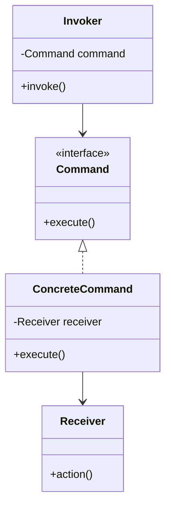

## Participants

### Command

Interface declaring `execute()`.

### ConcreteCommand

Implements command and calls receiver.

### Receiver

The actual object that performs the work.

### Invoker

Triggers the command.

### Client

Creates command and assigns receiver.

## Real-world LLD examples

### Text editor

Commands:

- Insert text
- Delete text
- Copy
- Paste
- Undo
- Redo

### Food delivery app

Commands:

- Place order
- Cancel order
- Refund payment
- Notify restaurant

### Task queue

Each job is a command object.

### Remote control

Each button press executes a command.

### Transaction system

Commands can be logged and replayed.

## Advantages

- Decouples sender from receiver
- Supports undo and redo
- Supports queues and retries
- Supports logging and auditing
- Easy to add new commands

## Disadvantages

- More classes
- Simple operations can become verbose
- State needed for undo can be tricky

## Command vs Strategy

Strategy represents how to do something.

Command represents a request to do something.

Example:

- Strategy: choose discount calculation algorithm
- Command: apply discount to this order now

## Placement-ready answer

Command pattern encapsulates a request as an object. It decouples the invoker from the receiver and is useful for undo/redo, task queues, retries, logging, and remote-control-like systems.

---

# MVC

## Intent

Separate an application into Model, View, and Controller.

## Problem

If UI code, business logic, and data logic are mixed together, the application becomes hard to maintain.

Bad design:

```text
Button click code
  -> validates input
  -> updates database
  -> calculates business rules
  -> formats HTML
  -> sends response
```

Everything changes for every reason.

## Basic idea

Split responsibilities:

- Model: data and business rules
- View: presentation
- Controller: handles input and coordinates model and view

## Components

### Model

Represents application data and business logic.

Examples:

- `User`
- `Order`
- `Product`
- `BankAccount`
- `Student`

Model should not know about UI.

### View

Displays data to the user.

Examples:

- HTML page
- Mobile screen
- Console output
- Template

View should not contain core business logic.

### Controller

Handles user input and coordinates the flow.

Responsibilities:

- Accept request
- Validate request format
- Call service/model
- Select response/view

## Java-like web example

```java
class User {
    private final String id;
    private final String name;

    public User(String id, String name) {
        this.id = id;
        this.name = name;
    }

    public String getId() {
        return id;
    }

    public String getName() {
        return name;
    }
}

class UserService {
    public User getUser(String id) {
        return new User(id, "Amit");
    }
}

class UserView {
    public String render(User user) {
        return "User: " + user.getName();
    }
}

class UserController {
    private final UserService userService;
    private final UserView userView;

    public UserController(UserService userService, UserView userView) {
        this.userService = userService;
        this.userView = userView;
    }

    public String getUser(String id) {
        User user = userService.getUser(id);
        return userView.render(user);
    }
}
```

## MVC flow

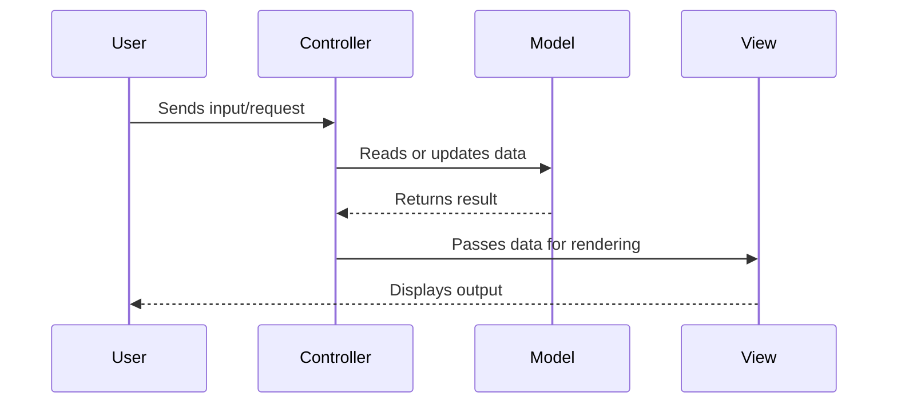

## Real-world examples

### Spring MVC

- Controller: `@Controller` or `@RestController`
- Model: entities, DTOs, services
- View: templates or JSON response

### Web application

- Model: product, cart, order
- View: product page, cart page
- Controller: handles add-to-cart request

### Student management system

- Model: student, course, enrollment
- View: student dashboard
- Controller: handles create/update/delete requests

## MVC in LLD interviews

For machine coding or LLD rounds, MVC helps organize code:

```text
controllers/
services/
models/
repositories/
views/
```

For backend-heavy systems, interviewers may prefer:

```text
Controller -> Service -> Repository -> Model
```

This is MVC-inspired layered architecture.

## Advantages

- Separates concerns
- Easier maintenance
- Easier testing
- UI can change without changing model
- Multiple views can use same model

## Disadvantages

- More files/classes
- Overkill for very small applications
- Controller can become too large if business logic is placed there

## Common mistakes

### Fat controller

Controller should not contain all business logic.

Prefer:

```text
Controller -> Service -> Domain Model
```

### Model as only database entity

In richer designs, model includes business behavior too.

### View calling database directly

View should display data, not fetch or mutate persistence.

## Placement-ready answer

MVC separates an application into Model, View, and Controller. Model manages data and business rules, View handles presentation, and Controller handles input and coordinates between them. It improves maintainability, testability, and separation of concerns.

---

# Pattern Comparison Cheat Sheet

## Quick selection guide

| Problem | Pattern |
|---|---|
| Need exactly one shared instance | Singleton |
| Need to hide object creation | Factory |
| Need to create families of related objects | Abstract Factory |
| Need to build object step by step | Builder |
| Need interchangeable algorithms | Strategy |
| Need to notify many objects about changes | Observer |
| Need to add behavior dynamically | Decorator |
| Need incompatible interfaces to work together | Adapter |
| Need access control, lazy loading, caching, or logging | Proxy |
| Need to represent request as object | Command |
| Need to separate UI, input handling, and data | MVC |

## Common pattern pairings in LLD

### Factory + Strategy

Factory creates the right strategy.

Example:

```java
PaymentStrategy strategy = PaymentStrategyFactory.create(paymentType);
strategy.pay(amount);
```

Used in:

- Payment systems
- Discount engines
- Route planners

### Observer + Command

Observer detects an event. Command performs a queued action.

Used in:

- Notification systems
- Event-driven order processing
- Task queues

### Decorator + Factory

Factory creates base object, decorators add optional behavior.

Used in:

- Coffee ordering
- Pizza ordering
- Notification channels

### Adapter + Strategy

Each third-party integration is adapted to a common strategy interface.

Used in:

- Payment gateway systems
- Shipping provider systems
- Authentication provider systems

### Proxy + Singleton

Singleton manages shared proxy/cache instance.

Used in:

- API clients
- Cache managers

## Similar patterns and differences

| Pattern A | Pattern B | Difference |
|---|---|---|
| Factory | Builder | Factory chooses concrete type; Builder assembles complex object |
| Factory | Abstract Factory | Factory creates one product; Abstract Factory creates product families |
| Strategy | Command | Strategy is an algorithm; Command is an action/request |
| Decorator | Proxy | Decorator adds behavior; Proxy controls access |
| Adapter | Facade | Adapter changes interface; Facade simplifies subsystem |
| Observer | Pub-Sub | Observer is direct object notification; Pub-Sub uses event broker |
| Strategy | State | Strategy usually changes by client choice; State changes by internal state |

---

# How to Use Patterns in LLD Interviews

## Step 1: Start with requirements

Never start by saying, "I will use Strategy here."

First understand:

- Functional requirements
- Non-functional requirements
- Entities
- Relationships
- Operations
- Constraints

## Step 2: Identify changing parts

Ask:

- What behavior may vary?
- What object creation may vary?
- What external system may change?
- What part needs extension?
- What part needs isolation?

Patterns should protect the changing parts.

## Step 3: Explain why the pattern fits

Bad answer:

```text
I used Strategy because Strategy is a design pattern.
```

Good answer:

```text
Payment method can vary across UPI, card, wallet, and future methods.
Instead of putting all payment logic in one class with conditionals, I use
PaymentStrategy so each method is independently extensible and testable.
```

## Step 4: Do not overuse patterns

Patterns are tools, not mandatory decorations.

Avoid:

- Adding factories for every class
- Making everything singleton
- Creating interfaces with only one implementation without reason
- Using Abstract Factory when simple Factory is enough
- Using patterns before requirements demand them

## Step 5: Connect to SOLID

Interviewers like when you connect pattern choices to design principles.

Examples:

- Strategy supports Open/Closed Principle.
- Adapter supports Dependency Inversion by hiding third-party APIs.
- Observer reduces coupling between event source and listeners.
- Builder improves readability and immutability.
- MVC supports Single Responsibility Principle.

## Example: Parking Lot LLD pattern usage

Possible patterns:

- Strategy for pricing calculation
- Factory for creating tickets or vehicle objects
- Singleton for parking lot manager, if there must be only one central manager
- Observer for notifying display boards when spots become available

But keep it simple. Do not force all patterns.

## Example: Food Delivery LLD pattern usage

Possible patterns:

- Strategy for delivery fee calculation
- Strategy for discount calculation
- Factory for payment method creation
- Observer for order status notifications
- Command for order cancellation/refund workflow

## Example: Movie Ticket Booking LLD pattern usage

Possible patterns:

- Strategy for seat pricing
- Observer for notifying users about booking status
- Command for booking and cancellation operations
- Proxy for access control or caching seat availability

## Example: Notification System LLD pattern usage

Possible patterns:

- Strategy for notification channel behavior
- Factory for creating notification senders
- Observer for event subscription
- Decorator for adding retry, logging, or priority behavior

## Example: Payment System LLD pattern usage

Possible patterns:

- Strategy for different payment methods
- Factory for creating payment strategy
- Adapter for third-party payment gateways
- Proxy for logging, retry, access control, or rate limiting
- Command for payment retry/refund operations

---

# Interview Revision: One-Liners

## Singleton

Use when exactly one shared instance is needed and global access is acceptable.

## Factory

Use when object creation should be centralized and hidden from the client.

## Abstract Factory

Use when creating families of related objects that must be compatible.

## Builder

Use when constructing complex objects with many optional fields or steps.

## Strategy

Use when multiple algorithms or behaviors should be interchangeable.

## Observer

Use when many objects need to react to state changes in another object.

## Decorator

Use when behavior should be added dynamically without subclass explosion.

## Adapter

Use when an existing or third-party interface does not match what your code expects.

## Proxy

Use when access to an object needs control, lazy loading, caching, logging, or security.

## Command

Use when an action should be represented as an object for undo, queueing, retrying, or logging.

## MVC

Use when separating data, presentation, and input handling in an application.

---

# Common Interview Questions

## Why not always use Singleton for shared services?

Because Singleton creates global state and hidden dependencies. It can make testing hard and can tightly couple code to a static access point. Dependency injection is often cleaner.

## Factory vs Abstract Factory?

Factory creates one kind of product. Abstract Factory creates families of related products.

## Builder vs Constructor?

Constructor is fine for few required fields. Builder is better when there are many optional fields, validation rules, or readability concerns.

## Strategy vs if-else?

Strategy replaces conditionals when behavior varies and new behaviors may be added. It makes each behavior independently testable and extensible.

## Observer vs polling?

Polling repeatedly checks for updates. Observer pushes updates when changes happen. Observer is usually more efficient and responsive.

## Decorator vs inheritance?

Inheritance fixes behavior at compile time. Decorator composes behavior dynamically at runtime.

## Adapter vs Proxy?

Adapter changes an incompatible interface into a compatible one. Proxy keeps the same interface but controls access to the real object.

## Command vs normal method call?

Command turns a method call into an object, allowing queueing, logging, undo, retry, and delayed execution.

## MVC vs layered architecture?

MVC separates Model, View, and Controller, often for UI applications. Layered architecture separates Controller, Service, Repository, and Model, commonly in backend systems. They are related but not identical.

---

# Final Placement Advice

In interviews, mention a design pattern only when it solves a concrete problem in your design.

A strong answer follows this structure:

```text
This part of the system varies because ...
I will hide that variation behind ...
The pattern that fits here is ...
This gives us ...
The trade-off is ...
```

Example:

```text
Payment method varies across UPI, card, and wallet. I will hide that variation
behind a PaymentStrategy interface. Strategy fits because each payment method is
an interchangeable algorithm. This makes the system open for adding new payment
methods. The trade-off is that we introduce more classes.
```

That is exactly the kind of reasoning placement interviewers want to hear.
